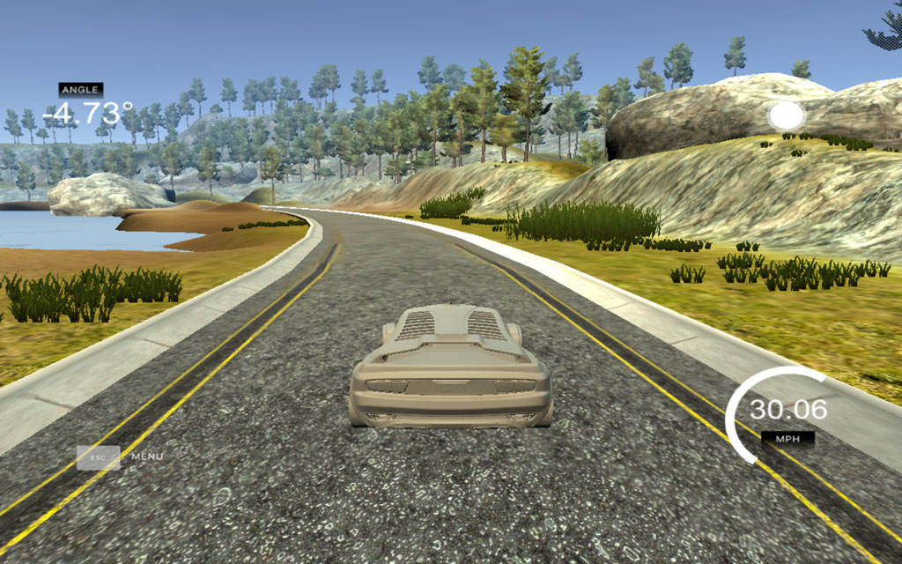
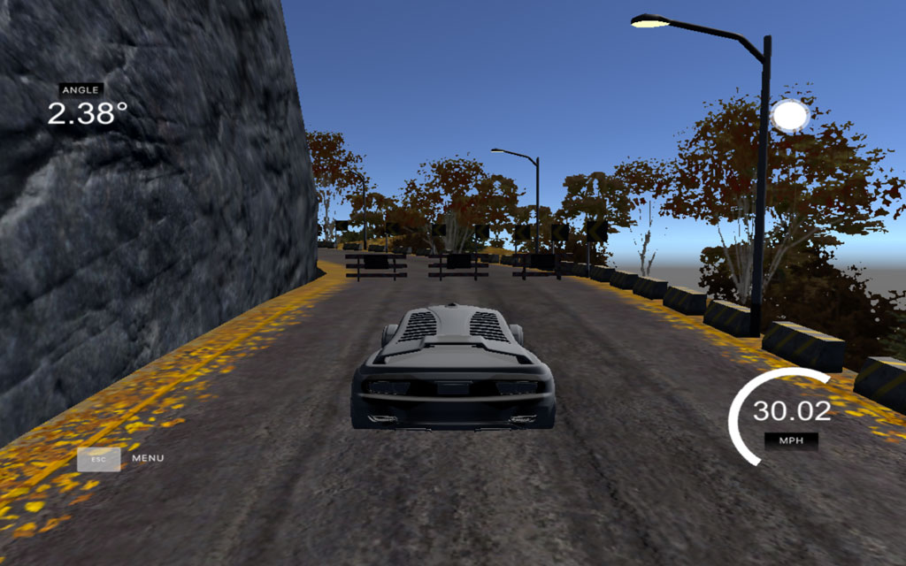

# Clone Driving Behavior

Self Driving Car Nanodegree - Behavioral Cloning Project

## Data Source

It turned out that collecting data on laptop was very difficult due to limitations of keyboard control. Steering angles were too sharp and rough. So I used [sample data for track 1](https://d17h27t6h515a5.cloudfront.net/topher/2016/December/584f6edd_data/data.zip) released by Udacity.

## Data Visualization

Solving the problem needs understanding the problem. First of all let's see how steering angles vary over time:

And how they are distributed:

I was trying to train a few models using this data but they all predicted zeros all the time. This is the result of huge part of samples with zero steering.

Now let's see how angles differ over time:

We can see that sharpness of differences between subsequent angles is not so bad for training the model. Large spikes will be "eaten" by the model and the output can be quite smooth.

Finally let's look at some images and steering angles from the dataset:

## Data Augmentation

Data augmentation is the key for solving our problem. We can sufficiently increase the volume of training data and help the model to find complex concepts needed to hold the car on the road.

### Random image from left, center, right cameras

The straight way is to use only center camera images for training. I did it in my first attempt. Most of the time the car is moving smoothly due to good prediction of zero steering angles but if there is a sharp turn, the car can't make it in time because the model can't predict large values of angles.

Using left and right camera images allows the model to predict values during the sharp turns. I simply add .25 offset to angle from left image sample and subtract .25 offset from angle from right image sample.

### Random image and angle translation

Classic technic for images but in our case we need to implement it for angles as well.

Randomly translated image and angle: -0.224515185415

### Random brightness

The brightness of images from track 1 and track 2 is very different so adding multiplier .25 + np.random.uniform() for V channel (from HSV) will help our model to work correctly on both tracks.

Image with random brightness

### Random shadow

We also need to prevent the model taking into account shadows during the training process. Let's draw randomly located shadows.

Image with randomly located shadow.

### Random image flip

Random flipping allows us increase the volume of training data.

Randomly flipped image, angle: -0.224515185415

## Preprocessing

I removed the 1/5 of the top and 25 px of the bottom of the image and resized it to 64x64px.

Cropped and resized image.

## Augmented data visualization

When taking random images from the original dataset and applying all random augmentations we obtain angle distribution that can be used for training.

Let's also look at some randomly augmented images:

## Model

I trained the following models:
- Pretrained VGG16
- Pretrained Inception
- End-to-end model with 8 convolution and 4 dense layers
- Comma.ai model with additional normalization and dropout layers

The best scores was from a comma model. It successfully finished first track after just 3 epochs of training. I noticed that 3x3 convolutions are not great choice for solving our kind of problem and we need to prevent overfitting for obtaining good results, especially on both tracks.

    ____________________________________________________________________________________________________
    Layer (type)                     Output Shape          Param #     Connected to                     
    ====================================================================================================
    lambda_1 (Lambda)                (None, 64, 64, 3)     0           lambda_input_1[0][0]             
    ____________________________________________________________________________________________________
    block1_conv1 (Convolution2D)     (None, 16, 16, 16)    3088        lambda_1[0][0]                   
    ____________________________________________________________________________________________________
    block2_conv1 (Convolution2D)     (None, 8, 8, 32)      12832       block1_conv1[0][0]               
    ____________________________________________________________________________________________________
    block3_conv1 (Convolution2D)     (None, 4, 4, 64)      51264       block2_conv1[0][0]               
    ____________________________________________________________________________________________________
    flatten_1 (Flatten)              (None, 1024)          0           block3_conv1[0][0]               
    ____________________________________________________________________________________________________
    activation_1 (Activation)        (None, 1024)          0           flatten_1[0][0]                  
    ____________________________________________________________________________________________________
    fc1 (Dense)                      (None, 1024)          1049600     activation_1[0][0]               
    ____________________________________________________________________________________________________
    fc1_dropout (Dropout)            (None, 1024)          0           fc1[0][0]                        
    ____________________________________________________________________________________________________
    output (Dense)                   (None, 1)             1025        fc1_dropout[0][0]                
    ====================================================================================================
    Total params: 1117809
    ____________________________________________________________________________________________________

## Regularization

We use the following approaches for regularization: aggressive augmenting data for training and dropout layer after FC1. We've obtained good results from these approaches seeing how the car successfully finishes the second track.

## Training

#### Batch generator
I take random image from random camera, randomly apply all previously described augmentations and generate batch for training or validation.

#### Hyperparameters tuning
I trained the model using custom generator, Adam optimizer, mean squared error loss function, batch size of 128 samples and 15 epochs of training.

#### Predictions
It was a good idea to plot real and predicted values after each training for understanding model behavior in particular cases. For example the following trained model will have some problems with straight parts of the road because it doesn't predict zero values with high accuracy.

Blue - real angles. Green - predicted angles.

## Model performance

The car was driving track 1 for an infinite amount of time and track 2 till the end of the road with throttle equal to 0.5

Although the car was jittering some of the time, because we need to make just one sharp turn at the end of second track. I think the better solution will be to control the throttle. In this case it will be easy to avoid jittering and let the car drive smoothly on both tracks.

The end of track 1

The end of track 2

## Acknowledgements

- [NVIDIA End to End Learning for Self-Driving Cars](https://arxiv.org/pdf/1604.07316v1.pdf)
- [Commaai steering model](https://github.com/commaai/research)
- [An augmentation based deep neural network approach to learn human driving behavior](https://chatbotslife.com/using-augmentation-to-mimic-human-driving-496b569760a9#.u48xp0cj4)
