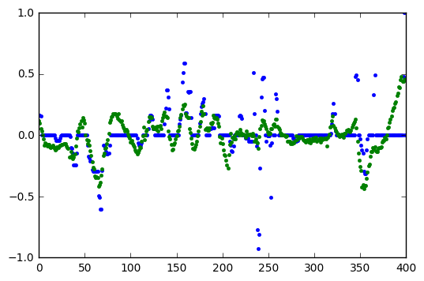

# Udacity Self Driving Car Nano Degree - Behavior Cloning Project

# 1. Data source

It turnes out that collecting data on laptop was very difficult due to limitations of keyboard control. Steering angles were too sharp and rough. So I used sample data for track 1 from here https://d17h27t6h515a5.cloudfront.net/topher/2016/December/584f6edd_data/data.zip.


```python
import numpy as np
import pandas as pd
import cv2
from keras.preprocessing.image import load_img, img_to_array
import matplotlib.image as mpimg

data_frame = pd.read_csv("driving_log.csv")
num_rows = data_frame.shape[0]
```

    Using TensorFlow backend.


# 2. Data understanding

Solving the problem needs understanding the problem. Let's load the data into memory and look at it.


```python
def center_image_path_and_angle(data_frame, index):
    image_path = data_frame.iloc[index].center
    angle = data_frame.iloc[index].steering
    return image_path, angle
```


```python
first_image_path, first_angle = center_image_path_and_angle(data_frame, 0)
first_image = img_to_array(load_img(first_image_path))

data = np.zeros((num_rows, first_image.shape[0], first_image.shape[1], first_image.shape[2]), dtype=np.float32)
labels = np.zeros(num_rows, dtype=np.float32)

for index in range(num_rows):
    image_path, angle = center_image_path_and_angle(data_frame, index)
    image = load_img(image_path)
    image = img_to_array(image)
    
    data[index] = image
    labels[index] = angle
    
    if index % 1000 == 0:
        print("Processed {} images".format(str(index)))

np.save("data", data)
np.save("labels", labels)
```

    Processed 0 images
    Processed 1000 images
    Processed 2000 images
    Processed 3000 images
    Processed 4000 images
    Processed 5000 images
    Processed 6000 images
    Processed 7000 images
    Processed 8000 images


## Steering angles


```python
import matplotlib.pyplot as plt
%matplotlib inline

def plot_range(y):
    plt.plot(y[:len(y)], '.')
    
plot_range(labels)
```


## Angle distribution

Too many samples has zero steering. The model learned from this dataset is predicting mean value all the time.


```python
import matplotlib.pyplot as plt

def plot_hist(y):
    hist, bins = np.histogram(y, bins=50)
    center = (bins[:-1] + bins[1:]) / 2
    width = 0.7 * (bins[1] - bins[0])
    plt.bar(center, hist, align='center', width = width)
    
plot_hist(labels)
```


## Angle transitions


```python
def plot_angle_changes(y):
    frames = []
    for i in range(1, len(y)):
        frames.append(y[i] - y[i-1])
    plt.plot(frames)
    
plot_angle_changes(labels)
```


## Sample images and steering angles


```python
import matplotlib.gridspec as gridspec

def visualize(data, labels):
    fig = plt.figure(figsize=(30, 10))
    gs = gridspec.GridSpec(2, 3)

    for i in range(6):
        random_i = np.random.randint(len(labels))
        ax = fig.add_subplot(gs[i])
        ax.set_title(labels[random_i])
        ax.imshow(data[random_i].astype(np.uint8))

    gs.tight_layout(fig)
    plt.show()

visualize(data, labels)
```


# 3. Data augmentation

We have about 8k samples and many of them with zero steering angle value. My first attempt was to train on this data. But the model didn't see any common patterns and always tended to predict zero steering value. So I applied different technics of data augmentation for increasing the volume of data and creating normal distribution of steering angles.


```python
import random
from skimage.exposure import rescale_intensity
from matplotlib.colors import rgb_to_hsv
import matplotlib.pyplot as plt
%matplotlib inline
```

## Random image from left, center, right cameras

We use all three images from every sample: center camera image without angle changes, left camera image with .25 steering angle shift and right camera image with -.25 shift. 


```python
def _random_image_path_and_angle(data_frame, index):
    OFF_CENTER_IMG = .25
    random_index = np.random.randint(3)
    angle = data_frame.iloc[index].steering
    if random_index == 0:
        image_path = data_frame.iloc[index].left[1:]
        angle += OFF_CENTER_IMG
    elif random_index == 2:
        image_path = data_frame.iloc[index].right[1:]
        angle -= OFF_CENTER_IMG
    else:
        image_path = data_frame.iloc[index].center
    return image_path, angle

image_path, angle = _random_image_path_and_angle(data_frame, 250)
print("Image path:", image_path)
print("Angle:", angle)
```

    Image path: IMG/right_2016_12_01_13_33_03_574.jpg
    Angle: -0.0925548


## Random image and angle translation


```python
def _random_angle_translate(angle):
    TRANSLATE_X_RANGE = 100
    TRANSLATE_ANGLE = .2
    x_translation = TRANSLATE_X_RANGE*np.random.uniform()-TRANSLATE_X_RANGE/2
    translated_angle = angle + x_translation/TRANSLATE_X_RANGE*2*TRANSLATE_ANGLE
    return translated_angle, x_translation
    
def _random_image_translate(image, x_translation):  
    TRANSLATE_Y_RANGE = 40
    y_translation = TRANSLATE_Y_RANGE*np.random.uniform()-TRANSLATE_Y_RANGE/2
    translation_matrix = np.float32([[1, 0, x_translation], [0, 1, y_translation]])
    translated_image = cv2.warpAffine(image, translation_matrix, (image.shape[1], image.shape[0]))
    return translated_image

angle, x_translation = _random_angle_translate(angle)
image = load_img(image_path)
image = img_to_array(image)
image = _random_image_translate(image, x_translation)
print("Angle:", angle)
print("Randomly translated image:")
plt.imshow(image.astype('uint8'))
```

    Angle: -0.224515185415
    Randomly translated image:


    <matplotlib.image.AxesImage at 0x24e720cc0>


## Random brightness


```python
def _random_brightness(image):
    BRIGHTNESS_RANGE = .25
    hsv_image = cv2.cvtColor(image, cv2.COLOR_RGB2HSV)
    random_brightness = BRIGHTNESS_RANGE + np.random.uniform()
    hsv_image[:,:,2] = hsv_image[:,:,2] * random_brightness
    rgb_image = cv2.cvtColor(hsv_image, cv2.COLOR_HSV2RGB)
    return rgb_image

image = _random_brightness(image)
print("Angle:", angle)
print("Image with random brightness:")
plt.imshow(image.astype('uint8'))
```

    Angle: -0.224515185415
    Image with random brightness:


    <matplotlib.image.AxesImage at 0x24df7d240>


## Random shadow

Roads contain shadows so we help the model to prevent taking into account them while steering.


```python
def _random_shadow(image):
    top_y = 320*np.random.uniform()
    top_x = 0
    bot_x = 160
    bot_y = 320*np.random.uniform()
    image_hls = cv2.cvtColor(image,cv2.COLOR_RGB2HLS)
    shadow_mask = 0*image_hls[:,:,1]
    X_m = np.mgrid[0:image.shape[0],0:image.shape[1]][0]
    Y_m = np.mgrid[0:image.shape[0],0:image.shape[1]][1]
    shadow_mask[((X_m-top_x)*(bot_y-top_y) -(bot_x - top_x)*(Y_m-top_y) >=0)]=1
    if np.random.randint(2)==1:
        random_bright = .5
        cond1 = shadow_mask==1
        cond0 = shadow_mask==0
        if np.random.randint(2)==1:
            image_hls[:,:,1][cond1] = image_hls[:,:,1][cond1]*random_bright
        else:
            image_hls[:,:,1][cond0] = image_hls[:,:,1][cond0]*random_bright    
    image = cv2.cvtColor(image_hls,cv2.COLOR_HLS2RGB)
    return image

image = _random_shadow(image)
print("Angle:", angle)
print("Image with randomly located shadow:")
plt.imshow(image.astype('uint8'))
```

    Angle: 0.224515185415
    Image with randomly located shadow:


    <matplotlib.image.AxesImage at 0x24e412710>


## Random image flip


```python
def _random_vertical_flip(image, angle):
    flipped_image = np.fliplr(image)
    flipped_image_angle = -angle
    if np.random.randint(2) == 0:
        return flipped_image, flipped_image_angle
    else:
        return image, angle
    
image, angle = _random_vertical_flip(image, angle)
print("Angle:", angle)
print("Randomly flipped image:")
plt.imshow(image.astype('uint8'))
```

    Angle: -0.224515185415
    Randomly flipped image:


    <matplotlib.image.AxesImage at 0x24e32e4e0>


# 4. Preprocessing

## Crop and resize

We removed the 1/5 of top and 25 px pf bottom of the image and resized it to 64x64px for end-to-end model. Optionally we resize images to 229x299px for pretrained Inception model.


```python
def _crop(image):
    h = image.shape[0]
    w = image.shape[1]
    cropped = image[int(h/5.):h-25,:,:]
    return cropped

def _resize(image, height, width):
    resized = cv2.resize(image, (height, width), interpolation=cv2.INTER_AREA)
    return resized

image = _crop(image)
image = _resize(image, 64, 64)
print("Angle:", angle)
print("Cropped and resized image:")
plt.imshow(image.astype('uint8'))
```

    Angle: -0.224515185415
    Cropped and resized image:


    <matplotlib.image.AxesImage at 0x24f594e80>


# 6. Random augment and preprocess image

All random augmentations in one function for using in data generators.


```python
def random_augment_image_and_angle(data_frame, resize_height, resize_width):
    num_rows = data_frame.shape[0]
    index = np.random.randint(num_rows)
    image_path, angle = _random_image_path_and_angle(data_frame, index)
    angle, x_translation = _random_angle_translate(angle)
    image = load_img(image_path)
    image = img_to_array(image)
    image = _random_image_translate(image, x_translation)
    image = _random_brightness(image)
    image = _random_shadow(image)
    image, angle = _random_vertical_flip(image, angle)
    image = _crop(image)
    image = _resize(image, resize_height, resize_width)
    return image, angle

image, angle = random_augment_image_and_angle(data_frame, 64, 64)
print(angle)
plt.imshow(image.astype('uint8'))
```

    -0.19013257567


    <matplotlib.image.AxesImage at 0x251646630>


# 7. Data generators

We need data generators for generating randomly augmented images from training and validation data sets.


```python
def data_generator(data_frame, resize_height, resize_width, batch_size=128):
    X_batch = np.zeros((batch_size, resize_height, resize_width, 3), dtype=np.float)
    y_batch = np.zeros(batch_size, dtype=np.float)
    index = 0
    while 1:
        image, angle = random_augment_image_and_angle(data_frame, resize_height, resize_width)
        X_batch[index] = image
        y_batch[index] = angle
        index += 1

        if index >= batch_size:
            yield X_batch, y_batch
            X_batch = np.zeros((batch_size, resize_height, resize_width, 3), dtype=np.float)
            y_batch = np.zeros(batch_size, dtype=np.float)
            index = 0

def original_data_generator(data_frame, resize_height, resize_width, batch_size=128):    
    while 1:
        X_batch = np.zeros((batch_size, resize_height, resize_width, 3), dtype=np.float)
        y_batch = np.zeros(batch_size, dtype=np.float)

        for index in np.arange(batch_size):
            image_path = data_frame.iloc[index].center
            image = cv2.imread(image_path)
            image = img_to_array(image)
            image = _crop(image)
            image = _resize(image, resize_height, resize_width)
            angle = data_frame.iloc[index].steering
            X_batch[index] = image
            y_batch[index] = angle

        yield X_batch, y_batch
```

# 8. Augmented data visualization


```python
val_gen = data_generator(data_frame, 64, 64, batch_size=4000)
X_batch, y_batch = next(val_gen)

plt.plot(y_batch, ".")
```


    [<matplotlib.lines.Line2D at 0x251988e10>]


```python
plt.hist(y_batch, bins=119)
```


    (array([   1.,    0.,    0.,    0.,    1.,    0.,    0.,    0.,    0.,
               0.,    0.,    0.,    1.,    0.,    0.,    0.,    2.,    1.,
               0.,    2.,    3.,    2.,    2.,    4.,    2.,    1.,    3.,
               9.,    6.,    9.,   10.,   14.,   10.,   22.,   17.,   66.,
              59.,   58.,   70.,   76.,   62.,   74.,   70.,   76.,   75.,
              79.,   70.,   89.,  113.,  122.,  113.,  102.,  123.,  108.,
              98.,   87.,   99.,  104.,   76.,  122.,  126.,  121.,  134.,
             112.,  127.,  100.,  107.,   73.,   73.,   69.,   72.,   71.,
              66.,   60.,   49.,   66.,   65.,   46.,   31.,   15.,   17.,
              16.,    8.,   11.,    9.,   10.,    3.,    8.,    2.,    4.,
               1.,    2.,    5.,    1.,    1.,    2.,    0.,    0.,    2.,
               0.,    0.,    0.,    1.,    0.,    0.,    0.,    0.,    0.,
               0.,    0.,    0.,    0.,    0.,    0.,    0.,    0.,    0.,
               0.,    1.]),
     array([-1.17090302, -1.15028806, -1.1296731 , -1.10905814, -1.08844318,
            -1.06782822, -1.04721326, -1.0265983 , -1.00598334, -0.98536838,
            -0.96475342, -0.94413845, -0.92352349, -0.90290853, -0.88229357,
            -0.86167861, -0.84106365, -0.82044869, -0.79983373, -0.77921877,
            -0.75860381, -0.73798885, -0.71737389, -0.69675893, -0.67614397,
            -0.65552901, -0.63491405, -0.61429909, -0.59368413, -0.57306917,
            -0.55245421, -0.53183925, -0.51122429, -0.49060933, -0.46999437,
            -0.44937941, -0.42876445, -0.40814949, -0.38753453, -0.36691957,
            -0.34630461, -0.32568965, -0.30507469, -0.28445973, -0.26384477,
            -0.24322981, -0.22261485, -0.20199989, -0.18138493, -0.16076997,
            -0.14015501, -0.11954005, -0.09892509, -0.07831013, -0.05769517,
            -0.03708021, -0.01646525,  0.00414971,  0.02476467,  0.04537963,
             0.06599459,  0.08660955,  0.10722451,  0.12783947,  0.14845443,
             0.16906939,  0.18968435,  0.21029931,  0.23091428,  0.25152924,
             0.2721442 ,  0.29275916,  0.31337412,  0.33398908,  0.35460404,
             0.375219  ,  0.39583396,  0.41644892,  0.43706388,  0.45767884,
             0.4782938 ,  0.49890876,  0.51952372,  0.54013868,  0.56075364,
             0.5813686 ,  0.60198356,  0.62259852,  0.64321348,  0.66382844,
             0.6844434 ,  0.70505836,  0.72567332,  0.74628828,  0.76690324,
             0.7875182 ,  0.80813316,  0.82874812,  0.84936308,  0.86997804,
             0.890593  ,  0.91120796,  0.93182292,  0.95243788,  0.97305284,
             0.9936678 ,  1.01428276,  1.03489772,  1.05551268,  1.07612764,
             1.0967426 ,  1.11735756,  1.13797252,  1.15858748,  1.17920244,
             1.1998174 ,  1.22043236,  1.24104732,  1.26166228,  1.28227724]),
     <a list of 119 Patch objects>)


```python
visualize(X_batch, y_batch)
```


# 9. Trying different models


```python
def save_model_and_weights():
    model.save_weights('model.h5')
    with open('model.json', 'w') as file:
        json.dump(model.to_json(), file)
    print("Model and weights saved")
```


```python
from keras.applications.vgg16 import VGG16
from keras.preprocessing import image
from keras.applications.vgg16 import preprocess_input
from keras.models import Model
from keras.models import Sequential
from keras.layers import Dense, GlobalAveragePooling2D, Input, Convolution2D
from keras.layers import Activation, MaxPooling2D, Flatten, Dropout
from keras.layers import Lambda, ELU, Merge, BatchNormalization

def end_to_end_model(input_height, input_width):
    input_shape = (input_height, input_width, 3)
    model = Sequential()
    model.add(Lambda(lambda x: x/255.-0.5,input_shape=input_shape))
    
    # Block 1
    model.add(Convolution2D(3, 1, 1, border_mode='same', name='block1_conv1', init='he_normal', activation='elu'))
    
    # Block 2
    model.add(Convolution2D(32, 3, 3, border_mode='same', name='block2_conv1', init='he_normal', activation='elu'))
    model.add(Convolution2D(32, 3, 3, border_mode='same', name='block2_conv2', init='he_normal', activation='elu'))
    model.add(MaxPooling2D((2, 2), strides=(2, 2), name='block1_pool'))
    
    # Block 3
    model.add(Convolution2D(64, 3, 3, border_mode='same', name='block3_conv1', init='he_normal', activation='elu'))
    model.add(Convolution2D(64, 3, 3, border_mode='same', name='block3_conv2', init='he_normal', activation='elu'))
    model.add(MaxPooling2D((2, 2), strides=(2, 2), name='block2_pool'))
    
    # Block 4
    model.add(Convolution2D(128, 3, 3, border_mode='same', name='block4_conv1', init='he_normal', activation='elu'))
    model.add(Convolution2D(128, 3, 3, border_mode='same', name='block4_conv2', init='he_normal', activation='elu'))
    model.add(Convolution2D(128, 3, 3, border_mode='same', name='block4_conv3', init='he_normal', activation='elu'))
    model.add(MaxPooling2D((2, 2), strides=(2, 2), name='block3_pool'))
    
    model.add(Flatten())
    model.add(Dense(512, name='fc1', init='he_normal', activation='elu'))
    model.add(Dropout(0.5, name='fc1_dropout'))
    model.add(Dense(64, name='fc2', init='he_normal', activation='elu'))
    model.add(Dropout(0.5, name='fc2_dropout'))
    model.add(Dense(16, name='fc3',init='he_normal', activation='elu'))
    model.add(Dropout(0.5, name='fc3_dropout'))
    model.add(Dense(1, name='output', init='he_normal'))
    
    return model

def pretrained_VGG16(input_height, input_width):
    input_shape = (input_height, input_width, 3)
    model = Sequential()
    model.add(Lambda(lambda x: x/255.-0.5,input_shape=input_shape))
    model.add(Convolution2D(3, 1, 1, border_mode='same', name='color_conv', activation='elu'))
    x0 = model.output
    vgg_model = VGG16(weights='imagenet', include_top=False)(x0)    
    x1 = Flatten()(vgg_model)
    x1 = Activation('relu')(x1)
    x1 = Dense(1024, activation='relu')(x1)
    predictions = Dense(1, activation='linear')(x1)
    model = Model(input=model.input, output=predictions)
    for layer in model.layers[0:2]:
        layer.trainable = True
    for layer in model.layers[2:12]:
        layer.trainable = False
    for layer in model.layers[12:]:
        layer.trainable = True
    return model

def comma_model(input_height, input_width):
    input_shape = (input_height, input_width, 3)
    model = Sequential()
    model.add(Lambda(lambda x: x/255.-0.5,input_shape=input_shape))
    model.add(Convolution2D(3, 1, 1, border_mode='same', name='block1_conv1', init='he_normal', activation='relu'))
    model.add(Convolution2D(16, 8, 8, subsample=(4, 4), border_mode="same", input_shape=(input_height, input_width, 3)))
    model.add(Activation('relu'))
    model.add(Convolution2D(32, 5, 5, subsample=(2, 2), border_mode="same"))
    model.add(Activation('relu'))
    model.add(Convolution2D(64, 5, 5, subsample=(2, 2), border_mode="same"))
    model.add(Flatten())
    model.add(Activation('relu'))
    model.add(Dense(1024))
    model.add(Activation('relu'))
    model.add(Dropout(0.5))
    model.add(Dense(1))
    model.add(Activation('linear'))
    return model
```

## Choose model with best accuracy

I tried different models. The best scores was from a comma model with additional dropout layer. It can successfully steer a car after just 3 epochs of training. I noticed that 3x3 convolutions are not great choice in this kind of problem and we need to prevent overfitting for obtaining good results on both tracks.


```python
from keras.utils import np_utils
from keras.preprocessing.image import ImageDataGenerator
from keras.models import model_from_json
import json

input_height = 64
input_width = 64
batch_size = 128

model = comma_model(input_height, input_width)
model.summary()
```

    ____________________________________________________________________________________________________
    Layer (type)                     Output Shape          Param #     Connected to                     
    ====================================================================================================
    lambda_4 (Lambda)                (None, 64, 64, 3)     0           lambda_input_5[0][0]             
    ____________________________________________________________________________________________________
    block1_conv1 (Convolution2D)     (None, 64, 64, 3)     12          lambda_4[0][0]                   
    ____________________________________________________________________________________________________
    convolution2d_10 (Convolution2D) (None, 16, 16, 16)    3088        block1_conv1[0][0]               
    ____________________________________________________________________________________________________
    activation_16 (Activation)       (None, 16, 16, 16)    0           convolution2d_10[0][0]           
    ____________________________________________________________________________________________________
    convolution2d_11 (Convolution2D) (None, 8, 8, 32)      12832       activation_16[0][0]              
    ____________________________________________________________________________________________________
    activation_17 (Activation)       (None, 8, 8, 32)      0           convolution2d_11[0][0]           
    ____________________________________________________________________________________________________
    convolution2d_12 (Convolution2D) (None, 4, 4, 64)      51264       activation_17[0][0]              
    ____________________________________________________________________________________________________
    flatten_4 (Flatten)              (None, 1024)          0           convolution2d_12[0][0]           
    ____________________________________________________________________________________________________
    activation_18 (Activation)       (None, 1024)          0           flatten_4[0][0]                  
    ____________________________________________________________________________________________________
    dense_7 (Dense)                  (None, 1024)          1049600     activation_18[0][0]              
    ____________________________________________________________________________________________________
    activation_19 (Activation)       (None, 1024)          0           dense_7[0][0]                    
    ____________________________________________________________________________________________________
    dropout_4 (Dropout)              (None, 1024)          0           activation_19[0][0]              
    ____________________________________________________________________________________________________
    dense_8 (Dense)                  (None, 1)             1025        dropout_4[0][0]                  
    ____________________________________________________________________________________________________
    activation_20 (Activation)       (None, 1)             0           dense_8[0][0]                    
    ====================================================================================================
    Total params: 1117821
    ____________________________________________________________________________________________________


# 10. Training and validation split


```python
data_frame_val, data_frame_train = np.split(data_frame.sample(frac=1), [batch_size])
batches_per_epoch = int(data_frame_train.shape[0]/batch_size)
```

# 11. Training


```python
start_epoch = 3
end_epoch = 6

model.compile(optimizer="adam", loss="mse")

# Continuous training
model.load_weights('model.h5')

# Pre-train evaluation
val_gen = data_generator(data_frame_val, input_height, input_width, batch_size=batch_size)
val_loss = model.evaluate_generator(val_gen, val_samples=batch_size)
print('Pre-train evaluation loss = {}'.format(val_loss))

# Training
epoch = start_epoch
while True:
    print('Epoch {}'.format(epoch), end=': ')
    
    train_gen = data_generator(data_frame_train, input_height, input_width, batch_size=batch_size)
    val_gen = data_generator(data_frame_val, input_height, input_width, batch_size=batch_size)
    
    history = model.fit_generator(
        train_gen,
        samples_per_epoch = batches_per_epoch * batch_size,
        nb_epoch = 1,
        validation_data=val_gen,
        nb_val_samples = batch_size,
        verbose = 1)
    
    save_model_and_weights()
    
    epoch += 1
    if epoch >= end_epoch:
        break
```

    Pre-train evaluation loss = 0.02334577590227127
    Epoch 3: Epoch 1/1
    7808/7808 [==============================] - 78s - loss: 0.0287 - val_loss: 0.0192
    Model and weights saved
    Epoch 4: Epoch 1/1
    7808/7808 [==============================] - 91s - loss: 0.0267 - val_loss: 0.0196
    Model and weights saved
    Epoch 5: Epoch 1/1
    7808/7808 [==============================] - 93s - loss: 0.0258 - val_loss: 0.0176
    Model and weights saved


# 12. Compare predicted and real steering values

## Load model, weights and original data


```python
with open('model.json', 'r') as jfile:
    model = model_from_json(json.load(jfile))  
model.load_weights('model.h5')

X_seq = np.load("data.npy")
y_seq = np.load("labels.npy")
X_seq = np.array([_resize(_crop(image), 64, 64) for image in X_seq])
```

## Predict


```python
predict_from = 0
num_predict_images = len(X_seq)
y_seq_predict = model.predict(X_seq[predict_from:predict_from+num_predict_images])
```

## The difference between real and predicted values


```python
import matplotlib.pyplot as plt

plot_from_index = 3200
num_plot_images = 400

y_seq_predict_mean = np.mean(y_seq_predict, axis=0, keepdims=True)
y_seq_predict = y_seq_predict 
print("Mean:", y_seq_predict_mean)

plt.plot(y_seq[plot_from_index:plot_from_index+num_plot_images], '.')
plt.plot(y_seq_predict[plot_from_index:plot_from_index+num_plot_images], '.')
```

    Mean: [[-0.01203087]]


    [<matplotlib.lines.Line2D at 0x248738cf8>]





# 13. Reflection

This model is working on both tracks but we can see that it is still a lot of space for improving.
